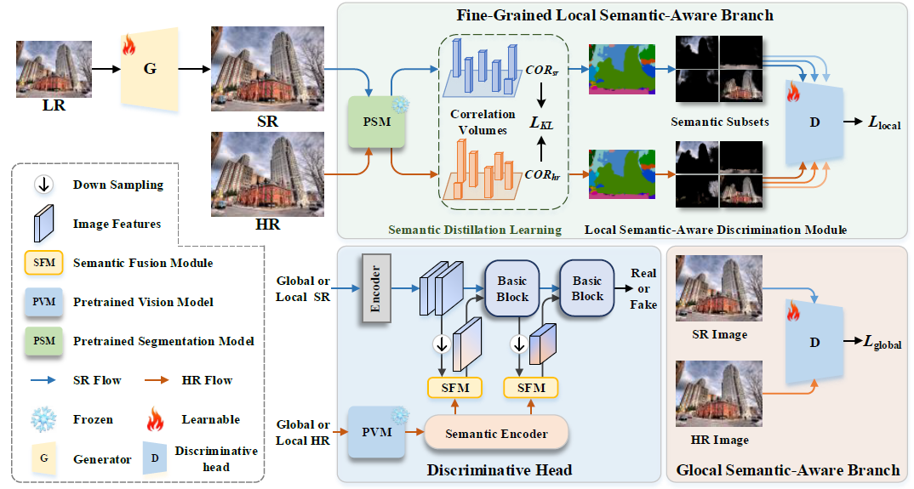

# Fine-Grained Semantic-Guided Image Super-Resolution

## 📝 Paper

- **Title**: Fine-Grained Semantic-Guided Image Super-Resolution

- **Authors**: Jin Du, Lei Huang, Jie Nie, Ke Zhang, Zhiqiang Wei

- **Overview Framework**

  

---

## 🔧 Installation

```bash
conda create -n FSGAN python=3.9
conda activate FSGAN
pip install torch==1.9.0+cu111 torchvision==0.10.0+cu111 torchaudio==0.9.0 \
  -f https://download.pytorch.org/whl/torch_stable.html
pip install -r requirements.txt
pip install git+https://github.com/openai/CLIP.git
pip install git+https://github.com/HRNet/HRNet-Semantic-Segmentation.git
```

---

## 📁 Data Preparation

1. **Training Data**:

   - Download [DIV2K](http://data.vision.ee.ethz.ch/cvl/DIV2K/DIV2K_train_HR.zip) and [Flickr2K](https://cv.snu.ac.kr/research/EDSR/Flickr2K.tar) datasets.
   - Combine them under `DF2K/train` and downscale for `train_x4`.
   - Run `subimages.py` to generate subimages:
     ```bash
     python subimages.py --n_thread 16
     ```

2. **Testing Data**:

   - Download Set5, Set14, Urban100, Manga109.
   - Place them under `Evaluation/` following the required structure.

---

## 🚀 Training

1. Download pretrained PSNR-oriented generator weights (e.g., RRDB.pth) to `pretrained/`.

2. Launch distributed training:

```bash
CUDA_VISIBLE_DEVICES=0,1,2,3 \
python -m torch.distributed.launch --nproc_per_node=4 train.py \
  --opt options/train_rrdb_P+FSGAN.yml \
  --resume pretrained/RRDB.pth \
  --distributed
```

You can modify paths using `--data_root` and `--out_root`.

---

## 🧪 Testing

Update `options/test_*.yml` with appropriate paths:

```bash
CUDA_VISIBLE_DEVICES=0 python test.py \
  --opt options/test_rrdb_P+FSGAN.yml \
  --output_path /path/to/output
```

Results will be saved in the specified output path.

---

## 📦 Repository Structure

```
Evaluation/        # Benchmark datasets (download separately)
model/             # Model definitions
options/           # Training/testing configuration files
datasets/          # Raw and processed training data
train.py           # Training entry
test.py            # Testing entry
subimages.py       # Crop training patches
requirements.txt
```

---

## 📖 Citation

If you find this work useful, please cite:

```bibtex
@article{du2026,
  title={Fine-Grained Semantic-Guided Image Super-Resolution},
  author={Du, Jin and Huang, Lei and Nie, Jie and Zhang, Ke and Wei, Zhiqiang},
  journal={IEEE Transactions on Multimedia},
  year={2026}
}
```

---

## 📄 License & Acknowledgment

This project is built upon and adapted from [SeD](https://github.com/lbc12345/SeD),[KAIR](https://github.com/cszn/KAIR), [Real-ESRGAN](https://github.com/xinntao/Real-ESRGAN/tree/master), [CLIP](https://github.com/openai/CLIP) and [HRNet](https://github.com/HRNet). Please follow their respective licenses for usage and redistribution. Thanks for their awesome works.

